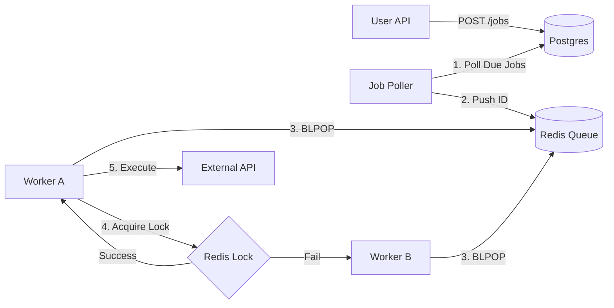

# 🚀 Distributed Job Scheduler

**A high-concurrency job scheduling system capable of handling distributed locking and delayed execution.**

---

## 📖 Overview

This is an attempt at a **Distributed System** (popular System Design problem), designed to handle the "Double-Booking" problem in clustered environments. There are a lot of use
cases in modern development where this is applicable - most notably, where third-party API calls need to be scheduled by entities utilizing this service.
With that in mind, I wanted to focus on creating it for those HTTP payloads where GET and POST requests can be scheduled and processed once and only once 
even with distributed servers by just providing the right JSON input.

TLDR: It solves the core challenge: **"If I have multiple worker servers, how do I ensure a job scheduled for 12:00 PM runs exactly once?"**

### Key Features
* **Distributed Locking:** Implemented custom Redis-based locking (Lua scripts) to prevent race conditions.
* **Resilient Scheduling:** Uses a "Poller -> Queue -> Worker" architecture to decouple ingestion from execution.
* **Observability:** Prometheus & Grafana dashboard integration to monitor queue depth and lock contention.
* **Horizontal Scalability:** Stateless worker nodes design allows for infinite horizontal scaling.

---

## 🏗 Architecture

The system uses a **Hybrid Polling/Push** architecture to balance reliability and latency.

---

## 📷 Screenshots of Logger:

- Shows a duplicate job failing due to the same Job ID already having a lock from Redis

- Grafana Dashboard with Prometheus endpoint (skips duplicate entries, so 10 claimed but only 5 completed)

